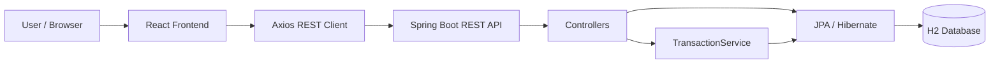

# Badal ERP — Full-Stack ERP Management System

A full-stack **Enterprise Resource Planning (ERP)** application for managing products, inventory, customers, sales, purchases, expenses, accounts, reports, tax summaries, and business performance.

The project uses a **React frontend** and a **Java Spring Boot REST API** backed by **JPA/Hibernate and H2**. Business transactions such as sales and purchases are handled on the backend so stock, GST, totals, receivables, and payables stay synchronized with the database.

---

## 1. Project Overview

Badal ERP is designed as a small-business ERP system that brings common day-to-day business operations into one application.

The application provides:

- Inventory/product management
- Customer management
- Sales and invoice processing
- Purchase recording
- Expense tracking
- Accounts and ledger views
- Profit & loss analysis
- Sales reports
- Tax/GST summary
- Monthly sales-vs-expense comparison
- Vendor management
- Low-stock monitoring
- Receipt printing
- PDF receipt/report generation
- CSV report export
- INR currency formatting

The frontend communicates with the backend through REST APIs.

---

## 2. High-Level Architecture



### Main request flow

```text
User
  ↓
React UI
  ↓
Axios
  ↓
REST Endpoint
  ↓
Spring Boot Controller
  ↓
TransactionService (for sales/purchases)
  ↓
Spring Data JPA Repository
  ↓
Hibernate
  ↓
H2 Database
  ↓
Response JSON
  ↓
React state update
  ↓
Updated UI
```

---

## 3. Technology Stack

### Frontend

| Technology | Usage |
|---|---|
| React 18 | User interface |
| React DOM | Rendering |
| React Router DOM | Routing/navigation dependency |
| Axios | REST API communication |
| Lucide React | UI icons |
| jsPDF | PDF receipt/report generation |
| react-qr-scanner | QR scanning dependency |
| Tailwind CSS | Frontend styling dependency |
| React Scripts 5 | Development/build tooling |
| Web Vitals | Performance measurement |
| Testing Library | React testing dependencies |

### Backend

| Technology | Usage |
|---|---|
| Java 17 | Backend programming language |
| Spring Boot 3.4.2 | Application framework |
| Spring Web | REST APIs |
| Spring Data JPA | Database access |
| Hibernate | ORM implementation |
| Spring Validation | Request/entity validation |
| Spring Security | Security configuration and password hashing |
| JJWT 0.12.6 | JWT creation |
| Maven | Dependency/build management |

### Database

| Technology | Usage |
|---|---|
| H2 | Relational database |
| Hibernate DDL auto update | Keeps the local schema synchronized with entities |
| H2 file mode | Persists data under `./data/erpdb` |

---

## 4. Project Structure

```text
erp-java-react-organized/
│
├── backend/
│   ├── pom.xml
│   └── src/
│       └── main/
│           ├── java/com/erp/management/
│           │   ├── ErpApplication.java
│           │   │
│           │   ├── config/
│           │   │   ├── JwtService.java
│           │   │   └── SecurityConfig.java
│           │   │
│           │   ├── controller/
│           │   │   ├── AuthController.java
│           │   │   ├── ExpenseController.java
│           │   │   ├── InventoryController.java
│           │   │   ├── PeopleController.java
│           │   │   ├── PurchaseController.java
│           │   │   └── SalesController.java
│           │   │
│           │   ├── dto/
│           │   │   └── AuthRequest.java
│           │   │
│           │   ├── entity/
│           │   │   ├── Customer.java
│           │   │   ├── Expense.java
│           │   │   ├── Product.java
│           │   │   ├── Purchase.java
│           │   │   ├── Sale.java
│           │   │   ├── SaleItem.java
│           │   │   └── User.java
│           │   │
│           │   ├── exception/
│           │   │   └── ApiExceptionHandler.java
│           │   │
│           │   ├── repository/
│           │   │   ├── CustomerRepository.java
│           │   │   ├── ExpenseRepository.java
│           │   │   ├── ProductRepository.java
│           │   │   ├── PurchaseRepository.java
│           │   │   ├── SaleRepository.java
│           │   │   └── UserRepository.java
│           │   │
│           │   └── service/
│           │       └── TransactionService.java
│           │
│           └── resources/
│               └── application.properties
│
├── Frontend/
│   ├── package.json
│   ├── package-lock.json
│   ├── postcss.config.js
│   ├── talwind.config.js
│   └── src/
│       ├── App.js
│       ├── App.css
│       ├── index.js
│       ├── index.css
│       ├── utils/
│       │   └── currency.js
│       └── ...
│
├── data/
│   └── erpdb.mv.db
│
├── .gitattributes
└── .gitignore
```

> Generated build output and IDE-specific files are intentionally excluded from Git through `.gitignore`.

---

# 5. Frontend Architecture

The current React application is centered around `Frontend/src/App.js`.

The application maintains business data in React state:

```text
products
people
expenses
sales
purchases
vendors
saleItems
```

It uses Axios to communicate with:

```text
http://localhost:5000/api
```

For example:

```text
GET  /api/inventory/all
GET  /api/people/all
GET  /api/expenses/all
GET  /api/sales/history
GET  /api/purchases/history
```

The application loads these datasets together using `Promise.all()` when the app starts or when data needs to be refreshed.

---

## 6. Frontend Modules

The sidebar currently provides these business areas:

1. Dashboard
2. Inventory
3. Sales
4. Purchases
5. People / Customers
6. Expenses
7. Accounts
8. Sales Report
9. Ledger
10. Profit & Loss
11. Vendors
12. Tax Summary
13. Monthly Comparison

---

## 7. Dashboard

The dashboard calculates business KPIs from the data loaded from the backend.

It displays:

- Product count
- Customer count
- Revenue
- Net profit
- Outstanding dues
- Stock value
- Receivables
- Payables
- Stock units
- Profit margin
- Low-stock alerts
- Monthly revenue vs expense performance
- Recent business/ledger information

### Important formulas

#### Revenue

```text
Total Revenue = Sum of completed sales
```

#### Net Profit

```text
Net Profit = Total Revenue - Total Expenses
```

#### Stock Value

```text
Stock Value = Σ(Product Quantity × Purchase Price)
```

#### Profit Margin

```text
Profit Margin =
((Revenue - Expenses) / Revenue) × 100
```

#### Customer Receivables

```text
Receivables = Σ Sale Due Amount
```

#### Supplier Payables

```text
Payables = Σ Purchase Due Amount
```

---

# 8. Inventory Management

The inventory module allows the user to:

- Add products
- Edit products
- Delete products
- Search products
- Track brand
- Track product type
- Track category
- Store HSN/SAC code
- Configure GST percentage
- Store purchase price
- Store selling price
- Track quantity
- Configure units
- Configure low-stock limits
- Store barcode
- Store serial numbers
- Track invoice information and dates

### Low-stock logic

A product is considered low stock when:

```text
quantity <= lowStockLimit
```

The dashboard then displays it under the low-stock alerts.

---

# 9. Sales Module

The sales workflow is one of the main transaction flows in the application.

### Sales flow

```text
Select customer
      ↓
Select product
      ↓
Enter quantity
      ↓
Calculate taxable amount
      ↓
Calculate GST
      ↓
Calculate item total
      ↓
Add item to invoice
      ↓
Enter payment information
      ↓
Create sale
      ↓
Backend validates stock
      ↓
Backend reduces inventory
      ↓
Backend recalculates totals
      ↓
Backend calculates due amount
      ↓
Sale is stored
      ↓
Customer debt is updated
      ↓
Frontend refreshes dashboard/history
```

### Sale calculation

For an item:

```text
Taxable Amount = Quantity × Selling Price

GST Amount =
Taxable Amount × GST % / 100

Item Total =
Taxable Amount + GST Amount
```

The backend recalculates these values rather than trusting the frontend values.

### Stock deduction

When a sale is created:

```text
Available Stock = Available Stock - Sold Quantity
```

The backend first verifies that sufficient stock exists.

If stock is insufficient, the transaction is rejected.

---

# 10. Purchase Module

The purchase workflow increases inventory.

### Purchase flow

```text
Select product
      ↓
Enter vendor
      ↓
Enter quantity
      ↓
Enter unit price
      ↓
Enter paid amount
      ↓
Create purchase
      ↓
Backend validates request
      ↓
Increase product quantity
      ↓
Calculate total amount
      ↓
Calculate due amount
      ↓
Determine payment status
      ↓
Save purchase history
```

### Purchase calculation

```text
Total Amount = Quantity × Unit Price

Due Amount =
max(0, Total Amount - Paid Amount)
```

Status becomes:

```text
Paid      → Due Amount = 0
Pending   → Due Amount > 0
```

---

# 11. Customer / People Module

Customers are stored using the `Customer` entity.

The application tracks:

- Name
- Phone
- Address
- GST number
- Total spending
- Current debt

During a sale, if the customer exists by name:

```text
Customer Current Debt += Sale Due Amount
Customer Total Spent += Sale Grand Total
```

This allows the ERP to maintain a simple customer receivable balance.

---

# 12. Expense Management

The expense module records:

- Expense title
- Amount
- Category
- Date

Expenses are used by the dashboard and reports to calculate:

```text
Net Profit = Revenue - Expenses
```

---

# 13. Accounts and Ledger

The Accounts section summarizes:

- Cash in
- Cash out
- Net position
- Receivables

The ledger combines sales and expenses into a unified transaction view.

A sale is represented as a positive amount:

```text
Sales → +Amount
```

An expense is represented as a negative amount:

```text
Expense → -Amount
```

The ledger is sorted by transaction date.

---

# 14. Sales Reports

The sales report provides:

- Invoice number
- Customer
- Total
- Paid amount
- Due amount
- Date
- Search/filter
- Sorting
- Total number of records
- Total sales
- Total paid
- Total due

Reports can be exported from the frontend.

### CSV export

The code generates a downloadable CSV file using the browser's `Blob` API.

### PDF export

The code uses:

```text
jsPDF
```

to generate PDF reports.

> The UI label currently says "Export Excel" for one ledger action, but the implementation actually generates CSV data. A future cleanup would be to rename that action to "Export CSV" to match the implementation.

---

# 15. Receipt Generation

After a sale, the application can prepare a receipt containing:

- Company information
- Invoice number
- Date
- Customer
- Payment mode
- Items
- Quantity
- Price
- Total
- Subtotal
- Paid amount
- Due amount

The receipt can be:

- Printed through the browser
- Downloaded as a PDF

The PDF is generated client-side using `jsPDF`.

---

# 16. Tax / GST Handling

Products have a configurable GST percentage.

Supported rates in the product form include:

```text
0%
5%
12%
18%
28%
```

For each sale item:

```text
GST = Taxable Amount × GST Rate / 100
```

The sale stores:

```text
subTotal
taxAmount
grandTotal
```

The frontend also provides a tax summary view.

> The current tax-summary calculation uses an application-level 18% rate for its high-level sales/expense summary. Individual product sales use the product's configured GST rate. For production-grade accounting, these two calculations should be unified around transaction-level GST data.

---

# 17. Monthly Comparison

The dashboard calculates the previous six months and compares:

- Sales
- Expenses
- Variance
- Margin

The application derives:

```text
Variance = Sales - Expenses

Margin =
((Sales - Expenses) / Sales) × 100
```

It also identifies:

- Average sales
- Average expenses
- Total sales
- Total expenses
- Best sales month
- Worst variance month

---

# 18. Backend Architecture

The backend follows a lightweight layered architecture:

```text
Controller
    ↓
Service
    ↓
Repository
    ↓
Entity
    ↓
Database
```

### Controllers

Controllers expose REST APIs.

Examples:

```text
AuthController
InventoryController
PeopleController
ExpenseController
SalesController
PurchaseController
```

### Service layer

`TransactionService` contains the most important transactional business logic.

It handles:

- Purchase creation
- Stock increase
- Purchase totals
- Purchase dues
- Sale creation
- Stock validation
- Stock reduction
- GST calculation
- Sale totals
- Sale dues
- Customer debt update

Both transaction methods use:

```java
@Transactional
```

This is important because a sale or purchase can modify multiple records and should be treated as one database transaction.

---

# 19. Persistence Layer

Spring Data JPA repositories provide database access.

Examples:

```java
public interface ProductRepository
    extends JpaRepository<Product, Long>
```

Similar repositories exist for:

- Customers
- Expenses
- Products
- Purchases
- Sales
- Users

This avoids writing repetitive CRUD SQL manually.

Hibernate maps the Java entity classes to database tables.

---

# 20. Main Database Entities

### User

Stores:

- ID
- Name
- Phone
- Email
- Password hash
- Role
- Timestamps

### Product

Stores:

- Name
- Brand
- Type
- Category
- HSN/SAC
- Purchase price
- Selling price
- GST
- Quantity
- Unit
- Low-stock limit
- Barcode
- Serial numbers
- Invoice number
- Purchase/created/updated timestamps

### Customer

Stores:

- Name
- Phone
- Address
- GST number
- Total spent
- Current debt

### Sale

Stores:

- Invoice number
- Customer
- Sale items
- Subtotal
- Tax
- Grand total
- Paid amount
- Due amount
- Payment mode
- Creation timestamp

### SaleItem

Stores:

- Product ID
- Product name
- Quantity
- Sale price
- Taxable amount
- GST percentage
- GST amount
- Total
- Serial number

### Purchase

Stores:

- Vendor
- Invoice number
- Product
- Quantity
- Unit price
- Total
- Paid amount
- Due amount
- Payment mode
- Status
- Notes
- Creation timestamp

### Expense

Stores:

- Title
- Amount
- Category
- Date

---

# 21. Database Relationships

The main relationships are logically:

```text
Customer
   │
   └── referenced by sale customer name

Product
   │
   ├── used by SaleItem
   │
   └── referenced by Purchase.productId

Sale
   │
   └── contains multiple SaleItem records

SaleItem
   │
   └── references Product by productId
```

`Sale.items` is persisted using JPA `@ElementCollection`, with a separate `sale_items` collection table.

---

# 22. REST API

Base URL:

```text
http://localhost:5000/api
```

## Authentication

### Register

```http
POST /auth/register
```

### Login

```http
POST /auth/login
```

The login endpoint verifies the stored BCrypt password and returns a JWT containing:

- User ID
- Role
- Issue time
- Expiration time

The generated token currently has a 7-day lifetime.

---

## Inventory

```http
POST   /inventory/add
GET    /inventory/all
PUT    /inventory/update/{id}
DELETE /inventory/delete/{id}
```

---

## Customers

```http
POST /people/add
GET  /people/all
GET  /people/{id}
```

---

## Expenses

```http
POST /expenses/add
GET  /expenses/all
```

---

## Sales

```http
POST /sales/create
GET  /sales/history
```

---

## Purchases

```http
POST /purchases/create
GET  /purchases/history
```

---

# 23. Example Sales API Flow

A typical request starts in React:

```text
handleSaleSubmit()
```

Then Axios sends:

```text
POST /api/sales/create
```

Spring Boot receives the request in:

```text
SalesController.create()
```

The controller delegates to:

```text
TransactionService.createSale()
```

The service then:

1. Validates sale items.
2. Loads each product.
3. Checks available stock.
4. Reduces stock.
5. Uses the product's selling price.
6. Calculates taxable amount.
7. Calculates GST.
8. Calculates item total.
9. Calculates invoice subtotal.
10. Calculates tax total.
11. Calculates grand total.
12. Calculates customer due.
13. Updates the customer's debt/spending when a matching customer exists.
14. Saves the sale.

The API returns the saved invoice.

React then calls `fetchAll()` so the dashboard, inventory and sales history reflect the new transaction.

---

# 24. Authentication and Security

The backend contains:

- Spring Security
- BCrypt password encoding
- JWT token generation
- Stateless session configuration
- CORS configuration
- Environment-based JWT secret

Passwords are stored using:

```text
BCryptPasswordEncoder
```

The JWT service creates a signed token containing:

```text
subject = user ID
role = user role
```

### Current implementation note

The project currently **generates JWTs but does not yet enforce JWT authentication on the ERP endpoints**.

`SecurityConfig` currently uses:

```text
permitAll()
```

for requests.

Therefore, for an interview, the accurate description is:

> "JWT-based authentication infrastructure is implemented for registration and login, including BCrypt password hashing and token generation. The next security step would be adding a JWT authentication filter and protecting business endpoints with role-based authorization."

This is preferable to claiming that every API is already JWT-protected.

---

# 25. Configuration

The backend uses environment variables with local defaults.

```properties
server.port=${PORT:5000}

spring.datasource.url=${DATABASE_URL:jdbc:h2:file:./data/erpdb;MODE=PostgreSQL;AUTO_SERVER=TRUE}

spring.datasource.username=${DATABASE_USERNAME:sa}

spring.datasource.password=${DATABASE_PASSWORD:}

spring.jpa.hibernate.ddl-auto=update

app.jwt.secret=${JWT_SECRET:replace-this-with-a-long-random-secret-key-at-least-32-bytes}
```

### Important

For a deployed/production environment, set a strong value for:

```text
JWT_SECRET
```

Do not commit real secrets to GitHub.

---

# 26. How to Run the Project

## Prerequisites

Install:

- Java 17+
- Maven 3.8+
- Node.js 18+
- npm
- Git

Verify:

```bash
java -version
mvn -version
node -v
npm -v
```

---

## 27. Start the Backend

Open a terminal in:

```text
backend/
```

Run:

```bash
mvn spring-boot:run
```

The backend runs on:

```text
http://localhost:5000
```

The H2 database is stored in file mode under:

```text
data/erpdb
```

---

## 28. Start the Frontend

Open another terminal in:

```text
Frontend/
```

Install dependencies:

```bash
npm install
```

Start React:

```bash
npm start
```

The frontend normally runs on:

```text
http://localhost:3000
```

The Axios client is configured to call:

```text
http://localhost:5000/api
```

---

# 29. Build the Frontend

For a production build:

```bash
npm run build
```

The generated build output is placed in:

```text
Frontend/build/
```

This directory is ignored by Git.

---

# 30. Testing

The frontend contains React Testing Library dependencies and the standard Create React App testing setup.

Run:

```bash
npm test
```

The current repository is primarily focused on application functionality; a future improvement would be adding comprehensive unit and integration tests for:

- Sales calculations
- GST calculations
- Stock validation
- Purchase calculations
- Customer debt updates
- REST controllers
- TransactionService

---

# 31. Error Handling

The backend includes:

```text
ApiExceptionHandler
```

for centralized API exception handling.

Controllers also return meaningful error messages for cases such as:

- Missing required information
- Product not found
- Customer not found
- Invalid quantity
- Invalid price
- Insufficient stock
- Duplicate phone/email
- Wrong password
- User not found

---

# 32. Important Business Rules

### Sales

- A sale must contain at least one item.
- Product must exist.
- Quantity must be greater than zero.
- Available stock must be sufficient.
- Selling price comes from the stored product.
- GST is calculated from the product's GST rate.
- Stock is reduced after successful validation.
- Due amount cannot be negative.

### Purchases

- Product, quantity and unit price are required.
- Quantity must be at least 1.
- Unit price cannot be negative.
- Stock increases after a purchase.
- Total = quantity × unit price.
- Due = max(total - paid, 0).

### Customers

When a named customer matches an existing customer:

```text
currentDebt += saleDue
totalSpent += saleGrandTotal
```

---

# 33. Git / GitHub

The project is structured as a Git repository with a root `.gitignore`.

Ignored files include:

```text
.idea/
*.iml
node_modules/
Frontend/build/
backend/target/
data/*.mv.db
.env
*.log
```

This keeps IDE files, dependencies, build artifacts, local database files, environment secrets and logs out of the repository.

---

# 34. Future Improvements

The current implementation is a strong functional ERP prototype, but the following improvements would make it more production-ready:

### Security

- Add JWT authentication filter.
- Protect business APIs.
- Add role-based authorization.
- Add refresh tokens.
- Add stronger password policies.
- Add request authorization based on the authenticated user.

### Architecture

- Split the large React `App.js` into reusable components/pages.
- Add a dedicated API service layer.
- Introduce DTOs for business APIs.
- Add MapStruct or explicit mapping between DTOs and entities.
- Improve validation and error response consistency.

### Database

- Move from H2 to PostgreSQL/MySQL for production.
- Add Flyway or Liquibase migrations.
- Add proper foreign-key relationships between sales, customers and products.
- Add indexes for frequently searched fields.

### Accounting

- Introduce proper double-entry accounting.
- Improve GST calculation at transaction level.
- Support CGST/SGST/IGST separately.
- Add payment/receipt vouchers.
- Add supplier ledger.
- Add customer ledger.
- Add outstanding payment aging.

### Reporting

- Improve PDF report layout.
- Generate real Excel `.xlsx` files instead of CSV for Excel-labelled exports.
- Add date-range filters.
- Add downloadable dashboard reports.

### Deployment

- Externalize the frontend API URL.
- Dockerize frontend/backend.
- Deploy backend with PostgreSQL.
- Configure HTTPS.
- Store secrets in environment variables/secrets management.
- Add CI/CD with GitHub Actions.

---

# 35. Interview Explanation

A concise interview explanation can be:

> **"I developed a full-stack ERP management system using React for the frontend and Java Spring Boot for the backend. The system manages inventory, customers, sales, purchases, expenses and financial reports. The frontend communicates with REST APIs using Axios, while the backend follows a controller-service-repository architecture with Spring Data JPA and Hibernate. H2 is used as the local relational database.**
>
> **The most important business logic is handled in a transactional service layer. For example, when a sale is created, the backend validates stock, calculates GST and invoice totals, deducts inventory, calculates the customer's outstanding amount, and persists the transaction inside a database transaction. Purchases work in the opposite direction by increasing inventory and calculating supplier dues.**
>
> **The dashboard derives KPIs such as revenue, expenses, profit, stock value, receivables and payables from the backend data. The system also supports receipt printing, PDF generation and CSV reporting.**
>
> **For security, I implemented BCrypt password hashing and JWT token generation. The current version has the JWT authentication infrastructure in place, while full JWT endpoint authorization is a planned next step."**

---

# 36. Key Interview Topics to Prepare

Be ready to explain:

### React

- `useState`
- `useEffect`
- `useMemo`
- Controlled forms
- Axios
- State refresh after CRUD operations
- Client-side calculations
- Conditional rendering

### Spring Boot

- REST controllers
- Dependency injection
- Service layer
- Repository layer
- `@Transactional`
- Validation
- Exception handling
- CORS
- Spring Security

### JPA / Hibernate

- `@Entity`
- `@Id`
- `@GeneratedValue`
- `JpaRepository`
- `@ElementCollection`
- `@Embeddable`
- Entity persistence
- Hibernate ORM

### Database

- Relational modeling
- Transactions
- Inventory updates
- Customer balances
- H2 file database
- Migration path to PostgreSQL

### Security

- BCrypt
- JWT
- Stateless authentication
- CORS
- Role claims
- Why JWT filter/authorization is needed

### Business Logic

- GST calculation
- Stock deduction
- Purchase stock addition
- Receivables
- Payables
- Profit calculation
- Low-stock alerts

---

# 37. Why This Project Is Good for an Interview

This project demonstrates more than CRUD.

It shows experience with:

- Full-stack development
- REST API design
- React state management
- Java/Spring Boot
- ORM and relational persistence
- Transaction management
- Inventory/business logic
- Financial calculations
- Authentication concepts
- PDF generation
- Reporting
- Git/GitHub
- Environment-based configuration

The strongest part to discuss in an interview is the **transaction flow**, especially how a sale changes multiple pieces of business data consistently.

---

## Author

**Badal Kumar**

Full-Stack ERP Management System

Built with:

**React + Java + Spring Boot + JPA/Hibernate + H2**

